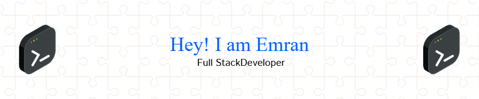

---

## 🌟 About Me  

I’m a passionate **Full-Stack Web Developer** from **Bangladesh** with expertise in building scalable, modern web applications using **React**, **Node.js**, and **MongoDB**. I thrive on working on innovative projects and exploring cutting-edge technologies to create impactful solutions.  

### 🔥 Current Activities:  
- 🌱 Diving deeper into **GSAP**.  
- 🚀 Building a **eCommerce Website** with **Nextjs** and **Node.js**.  
- 📚 Exploring **NestJS and PostgreSQL**.  

---

## 🚀 Technologies & Tools  

Here’s a quick snapshot of the technologies I work with:  

    
    
    
    
    
    

---

## &#x1f4c8; GitHub Stats

  

---

## 📞 Let’s Connect!  

I love collaborating on exciting projects and discussing innovative ideas. Feel free to reach out:  

  
  
  

